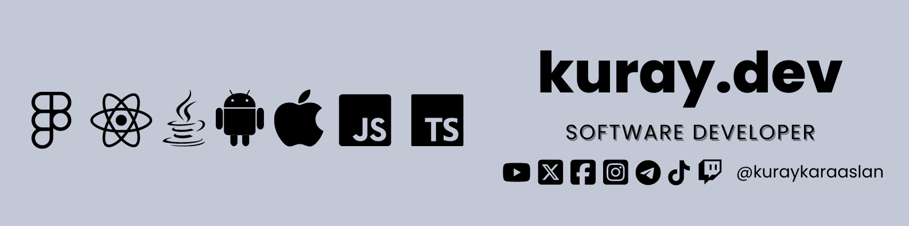

### 
I am a self-taught and highly motivated full-stack developer who working remotely since 2022

- **Proudly Open Source Contributor**
- I’m currently working on **IoT Projects**.
- I have  **[fiverr profile](https://www.fiverr.com/kuraykaraaslan)** and **[upwork profile](https://www.upwork.com/freelancers/~01694c65c4ad50b809)** for freelance work.
- I Have a **3D Printer** and I love to print things.

- My portfolio: **[kuray.dev](https://kuray.dev?s=GithubInfo)**
- My Resume: **[PDF](https://drive.google.com/file/d/17Ya5AC2nvcvccN-bS2pFsKFIm5v8dcWN/view?usp=drive_link)**
- My Public Key: **[kuraykaraaslan.pub](/kuraykaraaslan.pub)**
   

### My Introduction Video

### 
Languages and Tools:

<table><tr><td valign="top" width="30%" style="display: flex; justify-content: space-around; flex-wrap: wrap">

### Frontend  

  
  
  
  
  
  
 
  

</td><td valign="top" width="30%" style="display: flex; justify-content: space-around; flex-wrap: wrap">

### Backend  

  
  
  
  
  
  
  
  

</td><td valign="top" width="30%" style="display: flex; justify-content: space-around; flex-wrap: wrap">

### Tools

  
  
  
  
  

  

</td></tr></table>  

   

### Last Blog Posts:

### 
Connect with me:

  

  

  

### 
Github Stats:

  

 

     _  __ _   _  ____  _____ ___  __   ____  _____ _   _ 
    / |/ // \ / \/  __\/  _  \\  \/ /  /  _ \/  __// \ | \
    |   / | | | ||  \/|| / \ | \   /   | | \||  \  | | / /
    |   \ | \_/ ||    /| |-| | /  / __ | |_/||  /_ | \/ / 
    \_|\_\\_____/\_/\_\\_/ \_|/_ /  \/ \____/\____\\___/  
    

