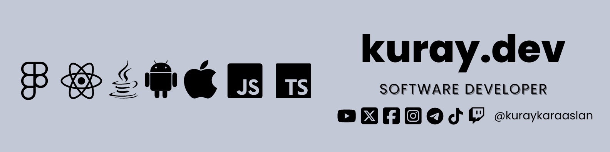

## Kuray Karaaslan — Full-Stack Software Engineer

I build **multi-tenant SaaS products** and **enterprise web applications** — from architecture to deployment.  
Based in Turkey. Available for consulting and contract work.

> Currently open to **long-term contracts** and **technical partnerships**.  
> → [kuray.dev](https://kuray.dev?s=GithubInfo) · [kuraykaraaslan@gmail.com](mailto:kuraykaraaslan@gmail.com)

---

## KUI — one design system, every runtime

**KUI** is my component system, built once and shipped to every runtime I deliver on. The UI kits share one semantic token contract, so a screen designed in one kit looks the same in the others: the same component API and the same tokens, whether it runs in a browser, on a server or on a phone. The standalone packages extend the family for heavy, domain-specific UI.

Every member carries the same branching-K mark. Its second color says what that package is for.

#### UI kits

| | Kit | Runtime | What's inside | |
|:-:|---|---|---|---|
|  | **KUIreact** | Next.js 16 · React 19 · Tailwind 4 | 315 components · 18 industry themes | [Live demo](https://kui-react.kuray.dev) · [GitHub](https://github.com/kuraykaraaslan/kui-react) |
|  | **KUIejs** | Express · EJS · Tailwind 4 | 206 components · 5 domain themes, server-rendered | [Live demo](https://kui-ejs.kuray.dev) · [GitHub](https://github.com/kuraykaraaslan/kui-ejs) |
|  | **KUInative** | Expo · React Native · NativeWind | 59 components, 1:1 with KUIreact · iOS, Android & web | [Live demo](https://kui-native.kuray.dev) · [GitHub](https://github.com/kuraykaraaslan/kui-native) |

<table>
<tr>
<td width="50%" align="center">

 

**KUIreact** · industry themes

</td>
<td width="50%" align="center">

 

**KUIejs** · domain themes

</td>
</tr>
</table>

#### Standalone packages

Each package has a framework-free TypeScript core and an optional React subpath.

| | Package | What it does | |
|:-:|---|---|---|
|  | [`@kuraykaraaslan/kui-viewer`](https://www.npmjs.com/package/@kuraykaraaslan/kui-viewer) | IFC/BIM 3D viewer in the browser — Three.js · web-ifc · @thatopen/fragments | [Live demo](https://kui-viewer.kuray.dev) · [npm](https://www.npmjs.com/package/@kuraykaraaslan/kui-viewer) |
|  | [`@kuraykaraaslan/kui-calendar`](https://www.npmjs.com/package/@kuraykaraaslan/kui-calendar) | Calendar / scheduler — month, week, day, agenda & resource views, RRULE recurrence, drag to create, move and resize | [Live demo](https://kui-calendar.kuray.dev) · [npm](https://www.npmjs.com/package/@kuraykaraaslan/kui-calendar) · [GitHub](https://github.com/kuraykaraaslan/kui-calendar) |
|  | **kui-gantt** | Gantt chart — WBS tree, dependency arrows, critical path, drag/resize, baselines, export | [Live demo](https://kui-gantt.kuray.dev) · [GitHub](https://github.com/kuraykaraaslan/kui-gantt) |
|  | **kui-player** | Video player — hls.js/dash.js adapters, subtitle overlay, speed control, Picture-in-Picture, touch gestures, Google Cast | [Live demo](https://kui-player.kuray.dev) · [GitHub](https://github.com/kuraykaraaslan/kui-player) |

---

### What I Build

- **SaaS Platforms** — Multi-tenant architecture, subscription billing, SSO, RBAC
- **Enterprise Web Apps** — Next.js App Router, Spring Boot, REST & event-driven APIs  
- **Mobile Apps** — Expo / React Native, cross-platform
- **Internal Tools** — Admin dashboards, reporting, workflow automation

---

### Open Source

| Repo | Description |
|---|---|
| [expo-react-native-boilerplate](https://github.com/kuraykaraaslan/expo-react-native-boilerplate) | Expo / React Native starter — Expo Router, Zustand, NativeWind |
| [express-boilerplate](https://github.com/kuraykaraaslan/express-boilerplate) | Express + TypeScript backend starter — routing, middleware, error handling |
| [learn-platform](https://github.com/kuraykaraaslan/learn-platform) | Knowledge platform for interns and junior developers — [learn.kuray.dev](https://learn.kuray.dev) |

---

### Premium

| Product | Description |
|---|---|
| [**next-boilerplate**](https://next-boilerplate.kuray.dev) | Production-ready multi-tenant SaaS starter — auth, payments, notifications, RBAC, dual-DB. Licensed commercially; [next-boilerplate.kuray.dev](https://next-boilerplate.kuray.dev) · [get in touch](mailto:kuraykaraaslan@gmail.com?subject=next-boilerplate) for access. |

---

### Stack

**Frontend**  

**Backend**  

**Mobile**  

**Data & Infra**  

---

### Latest Posts

---

### Connect

