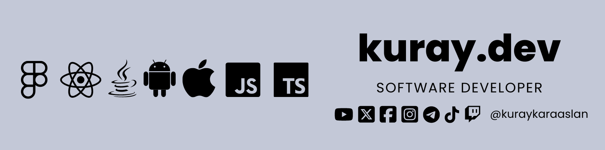

### 
I am a self-taught and highly motivated full-stack developer who working remotely since 2022

- Hire me and see the magic!

- I’m currently working on IoT Devices.

- I have a  [fiverr profile](https://www.fiverr.com/kuraykaraaslan).
  
  
- Fun fact: I Have a 3D Printer and I love to print things.

- How to reach me: [kuray.dev](https://kuray.dev?s=GithubInfo).

- My Resume: [PDF](https://drive.google.com/file/d/17Ya5AC2nvcvccN-bS2pFsKFIm5v8dcWN/view?usp=drive_link).
  
- My Public Key: [kuraykaraaslan.pub](/kuraykaraaslan.pub)

   

### 
Languages and Tools:

<table style="width:100%">
    <tr bgcolor="#c3c8d7">
        <th style="width:33.33%; background-color: black; color: white; align-items: center; justify-content: center;text-align: center">Frontend</th>
        <th style="width:33.33%; background-color: black; color: white; align-items: center; justify-content: center;text-align: center">Backend</th>
        <th style="width:33.33%; background-color: black; color: white; align-items: center; justify-content: center;text-align: center">Tools</th>
    </tr>
    <tr style="align-items: center; justify-content: center;text-align: center; background-color: #c3c8d7">
        <td>
        
        
        
        
        
    </td>
    <td>
    
    
    
    
    
    
    </td>
    <td>
    
    
    
    
    </td>
    </tr>
</table>

 

### 
Connect with me:

<a href="mailto:kuraykaraaslan@gmail.com"
    style="background-color: #d14836; color: white; width: 100px; text-decoration: none; padding: 10px; text-align: center; border-radius: 5px; display: inline-block;">
    
    Gmail
</a>
<a href="https://kuray.dev/contact"
    style="background-color: #0077b5; color: white; width: 100px; text-decoration: none; padding: 10px; text-align: center; border-radius: 5px; display: inline-block;">
    
    Phone
</a>
<a href="https://www.linkedin.com/in/kuraykaraaslan/" style="background-color: #0e76a8; color: white; width: 100px; text-decoration: none; padding: 10px; text-align: center; border-radius: 5px; display: inline-block;">
    
    LinkedIn
</a>
<a href="https://t.me/kuraykaraaslan" style="background-color: #0088cc; color: white; width: 100px; text-decoration: none; padding: 10px; text-align: center; border-radius: 5px; display: inline-block;">
    
    Telegram
</a>
<a href="https://www.instagram.com/kuraykaraaslan/" style="background-color: #c13584; color: white; width: 100px; text-decoration: none; padding: 10px; text-align: center; border-radius: 5px; display: inline-block;">
    
    Instagram 
</a>
<a href="https://twitter.com/kuraykaraaslan" style="background-color: #1da1f2; color: white; width: 100px; text-decoration: none; padding: 10px; text-align: center; border-radius: 5px; display: inline-block;">
    
    Twitter
</a>

 

### 
GitHub Stats:

  

   

     _  __ _   _  ____  _____ ___  __   ____  _____ _   _ 
    / |/ // \ / \/  __\/  _  \\  \/ /  /  _ \/  __// \ | \
    |   / | | | ||  \/|| / \ | \   /   | | \||  \  | | / /
    |   \ | \_/ ||    /| |-| | /  / __ | |_/||  /_ | \/ / 
    \_|\_\\_____/\_/\_\\_/ \_|/_ /  \/ \____/\____\\___/  

